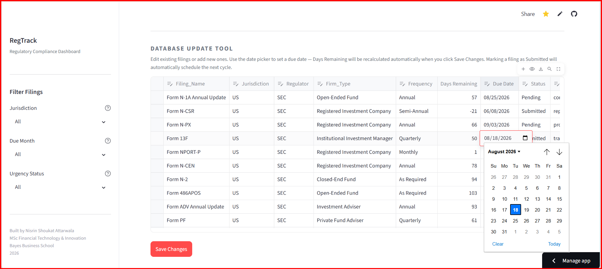

# Global Regulatory Compliance Tracker

A regulatory compliance dashboard built with Python and Streamlit to help teams monitor filing obligations across US (SEC) and UK (FCA/Companies House) jurisdictions.

Live Demo: [](https://regtech-compliance-dashboard-jpeftg6ajanxph3onhb7vb.streamlit.app/)

## Screenshots


*The main dashboard showing all filings, with the AI Explainer ready to be used.*


*Filtering by Month and Jurisdiction to isolate specific filings.*


*Filtering by Urgency Status - Overdue to isolate specific filings.*


*Filtering by Urgency Status - Due Soon to isolate specific filings.*


*The in-app Database Update Tool - edit filings, add new ones, and update due dates via a calendar picker without touching the CSV.*

---

## Project Overview

Rather than relying on manually updated status fields alone, the application recalculates deadline urgency from filing due dates each time it runs, helping teams identify overdue and upcoming obligations more reliably.

The project demonstrates how a maintained filing tracker can be enhanced with automated deadline monitoring, proactive alerts, and AI-generated plain-English filing explanations.

---

## Key Features

1. **Automated Deadline Engine**: A Python backend that calculates real-time `Days_Remaining` and dynamically assigns Urgency status (On Track, Due Soon, Overdue, Completed) independently of human input, eliminating stale data risk.
2. **Interactive Web Dashboard**: A live Streamlit application featuring dynamic jurisdiction, chronological month, and Urgency Status filters.
3. **Database Update Tool**: An in-app filing manager that lets users edit existing filings, add new ones, and update due dates via a calendar date picker — all without touching the CSV file directly. Days Remaining is automatically recalculated on save.
4. **Automatic Next-Cycle Scheduling**: When a filing is marked as Submitted, the system automatically creates a new Pending entry for the next cycle based on the filing's frequency (Daily, Monthly, Quarterly, Semi-Annual, Annual). Ad-hoc filings (As Required) are excluded and must be added manually.
5. **Generative AI Compliance Explainer**: An embedded AI assistant powered by Groq (LLaMA 3.3 70B) that generates plain-English filing summaries, regulatory risk warnings, and a filing-specific preparation checklist tailored to the exact filing type, regulator, firm type, and current urgency status.
6. **Proactive Alerting**: Surfaces overdue and near-term filing risks directly in the dashboard with a colour-coded alert banner.
7. **Cross-Jurisdiction Tracking**: Monitors both US (SEC, CFTC, NFA) and UK (FCA, Companies House, HMRC) regulatory reporting workflows in a single view.

---

## Tech Stack

| Component | Technology |
| :--- | :--- |
| **Backend Logic** | Python 3.11, Pandas, Datetime |
| **Frontend / UI** | Streamlit |
| **AI Integration** | Groq API (LLaMA 3.3 70B model) |
| **Deployment** | Streamlit Community Cloud, GitHub Codespaces |

---

## The Problem It Solves

Traditional compliance teams rely on static Excel trackers where a human must manually update a status from "Pending" to "Overdue." If a team member is absent, the data goes stale, increasing regulatory risk.

This tool solves that by decoupling the human-recorded Status from the machine-calculated Urgency. Every day the application runs, it compares the `Due_Date` against the live system clock and recalculates the urgency automatically. For example, a MiFIR Transaction Report might have a human status of "Pending," but the system will correctly flag it as "Overdue" if the deadline has passed.

---

## Architecture

The project follows a simple pipeline architecture where data flows in one direction:

1. **`filing_schedule.csv`**: The source of truth containing the list of filings, their jurisdiction, frequency, and relative due dates.
2. **`compliance_logic.py`**: The backend engine. It reads the CSV, calculates the actual calendar `Due_Date` based on the current system clock, and determines the `Urgency` status (Overdue, Due Soon, On Track, Completed).
3. **`app.py`**: The Streamlit frontend. It imports the processed DataFrame from `compliance_logic.py`, renders the interactive UI, handles user filtering, makes API calls to Groq for the AI Explainer, and hosts the Database Update Tool which writes changes back to `filing_schedule.csv`.

The Database Update Tool creates a feedback loop: users can edit the CSV through the UI, and the app immediately reruns `compliance_logic.py` to reflect the updated data across all KPI cards, the filing schedule table, and the deadline proximity chart.

---

## Design Choices and Methodology

- **Dynamic Date Calculation**: Instead of hardcoding static dates which would eventually become stale, the CSV stores `Days_From_Today`. The `compliance_logic.py` script calculates the actual calendar date dynamically every time the app runs, ensuring the project remains functional for anyone reviewing it months later.
- **Two-Layer Secret Management**: For local development in Codespaces, a `.env` file is used (and strictly ignored via `.gitignore`). For production, Streamlit Cloud's built-in Secrets management is used. This prevents accidental exposure of the Groq API key while ensuring the app runs in both environments.
- **Context-Aware AI Prompt Engineering**: The prompt sent to the Groq API is dynamically constructed from the filing name, regulator, firm type, jurisdiction, urgency status, and days remaining. The system message instructs the AI to produce filing-specific preparation checklists rather than generic advice — for example, a 485BPOS prompt will elicit guidance on the transmittal letter, wrap page, Part C exhibits, removal of liquidated fund data older than one year, and review of IMAs and sub-advisory agreements. This approach requires no hardcoded dictionaries and works automatically for any new filing added to the CSV.
- **Duplicate-Aware Auto-Scheduling**: When a filing is marked Submitted, the next-cycle logic checks the live edited table (not the stale loaded copy) before creating a new row, preventing duplicate Pending entries from being generated on repeated saves.
- **Unique Dropdown Labels for Duplicate Filings**: The AI Explainer dropdown appends the urgency status and due date to each filing label (e.g. `485BPOS — Due Soon (2026-10-10)`), ensuring users can distinguish between multiple open cycles of the same filing and that the AI always receives the correct row's data.
- **System-Wide Dependency Installation**: The `.devcontainer/devcontainer.json` is configured to run `pip install -r requirements.txt` globally within the container, rather than using a virtual environment. This is the correct, standard approach for Docker-based development environments like GitHub Codespaces.

---

## Limitations and Disclaimer

- **Not Financial or Legal Advice**: This dashboard is a portfolio project demonstrating technical implementation of RegTech concepts. It is not intended for use in actual regulatory reporting.
- **Simulated Data**: The filings and deadlines provided in the CSV are representative examples. In a production environment, this system would connect directly to a regulatory data feed or an internal GRC (Governance, Risk, and Compliance) platform API.
- **Stateless AI**: The Groq AI integration currently evaluates each filing in isolation based on the prompt. It does not maintain a conversational memory or have access to a firm's historical filing data.

---

## Scalability Design

As the number of tracked filings grows, the dashboard is designed to remain usable through two complementary approaches:

- **Tabbed Layout**: The interface is organised into four tabs — Overview, Filing Schedule, Charts, and Manage Filings — so each section lives on its own tab rather than stacking vertically on a single scrolling page. This keeps the UI clean regardless of how many filings are added.
- **Chart Capping**: The Deadline Proximity Chart displays only the 20 most urgent filings (sorted by days remaining), keeping the chart focused and readable. A label indicates when the view is capped.

---

## How to Run Locally

### Prerequisites
- Python 3.11
- A free API key from [Groq](https://console.groq.com/ )

### Setup Steps

1. Clone this repository:
   ```bash
   git clone https://github.com/nattarw-tech/regtech-compliance-dashboard.git
   cd regtech-compliance-dashboard
   ```

2. Create a `.env` file in the root directory and add your Groq API key:
   ```
   GROQ_API_KEY="your_key_here"
   ```

3. Install dependencies:
   ```bash
   pip install -r requirements.txt
   ```

4. Run the Streamlit app:
   ```bash
   streamlit run app.py
   ```

---

## About the Author

Built by **Nisrin Shoukat Attarwala**  
MSc Financial Technology & Innovation, Bayes Business School, 2026.

This project is part of a portfolio targeting roles in Fintech, RegTech, and Product Operations.  
See also: [DeFi Wallet Risk Intelligence](https://github.com/nattarw-tech/defi-wallet-risk-intelligence)

[](https://www.linkedin.com/in/nisrin-attarwala/)
