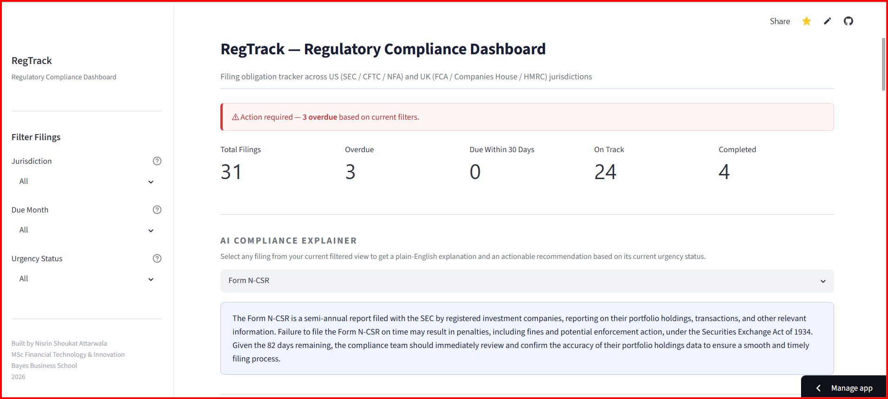
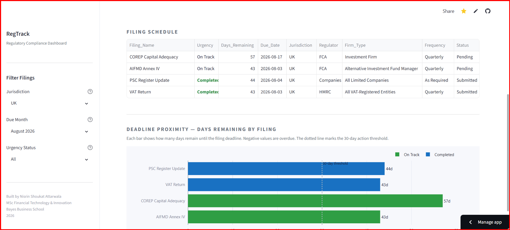
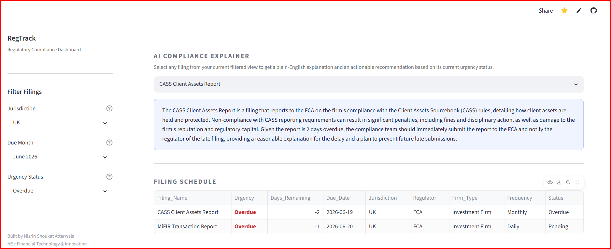
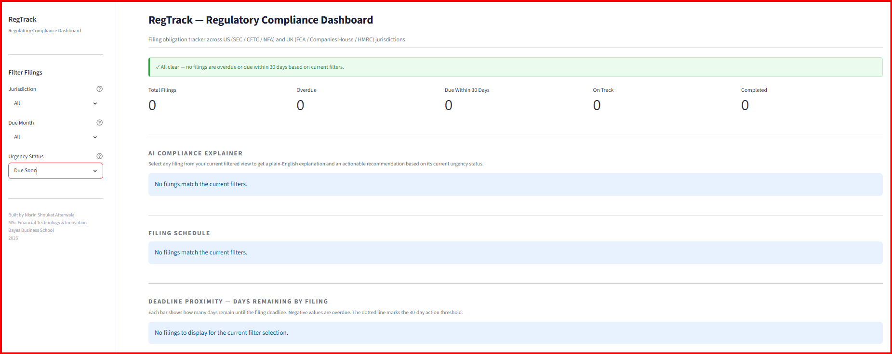

# Global Regulatory Compliance Tracker

<<<<<<< HEAD
## Project Overview
=======
A regulatory compliance dashboard built with Python and Streamlit to help teams monitor filing obligations across US (SEC) and UK (FCA/Companies House) jurisdictions.

Live Demo: [https://regtech-compliance-dashboard-jpeftg6ajanxph3onhb7vb.streamlit.app/](https://regtech-compliance-dashboard-jpeftg6ajanxph3onhb7vb.streamlit.app/)

## Screenshots
>>>>>>> f89c240 (Added screenshot files and fixed README: Python version, clone URL, and section divider)


*The main dashboard showing all filings, with the AI Explainer ready to be used.*


*Filtering by Month and Jurisdiction to isolate specific filings.*


*Filtering by Urgency Status - Overdue to isolate specific filings.*


*Filtering by Urgency Status - Due Soon to isolate specific filings.*

---

## Project Overview

Rather than relying on manually updated status fields alone, the application recalculates deadline urgency from filing due dates each time it runs, helping teams identify overdue and upcoming obligations more reliably.

The project demonstrates how a maintained filing tracker can be enhanced with automated deadline monitoring, proactive alerts, and AI-generated plain-English filing explanations.

Live Demo: [](https://regtech-compliance-dashboard-jpeftg6ajanxph3onhb7vb.streamlit.app/)

---

## Key Features

1. **Automated Deadline Engine**: A Python backend that calculates real-time `Days_Remaining` and dynamically assigns Urgency status (On Track, Due Soon, Overdue) independently of human input, eliminating stale data risk.
2. **Interactive Web Dashboard**: A live Streamlit application featuring dynamic jurisdiction, chronological month, and Urgency Status filters.
3. **Generative AI Integration**: An embedded "AI Compliance Explainer" powered by Groq (LLaMA 3.3) that instantly generates plain-English summaries of complex regulatory filings, their purpose, and the risks of non-compliance.
4. **Proactive Alerting**: Surfaces overdue and near-term filing risks directly in the dashboard.
5. **Cross-Jurisdiction Tracking**: Demonstrates monitoring for both US and UK regulatory reporting workflows.

---

## Tech Stack

| Component | Technology |
| :--- | :--- |
| **Backend Logic** | Python 3.11, Pandas, Datetime |
| **Frontend / UI** | Streamlit |
| **AI Integration** | Groq API (LLaMA 3.3 70B model) |
| **Deployment** | Streamlit Community Cloud, GitHub Codespaces |

---

## The Problem It Solves

Traditional compliance teams rely on static Excel trackers where a human must manually update a status from "Pending" to "Overdue." If a team member is absent, the data goes stale, increasing regulatory risk.

This tool solves that by decoupling the human-recorded Status from the machine-calculated Urgency. Every day the application runs, it compares the `Due_Date` against the live system clock and recalculates the urgency automatically. For example, a MiFIR Transaction Report might have a human status of "Pending," but the system will correctly flag it as "Overdue" if the deadline has passed.

---

## Architecture

The project follows a simple pipeline architecture where data flows in one direction:

1. **`filing_schedule.csv`**: The source of truth containing the list of filings, their jurisdiction, and relative due dates.
2. **`compliance_logic.py`**: The backend engine. It reads the CSV, calculates the actual calendar `Due_Date` based on the current system clock, and determines the `Urgency` status (Overdue, Due Soon, On Track, Completed).
3. **`app.py`**: The Streamlit frontend. It imports the processed DataFrame from `compliance_logic.py`, renders the interactive UI, handles user filtering, and makes API calls to Groq for the AI Explainer.

---

## Design Choices and Methodology

- **Dynamic Date Calculation**: Instead of hardcoding static dates (e.g., "2026-09-01") which would eventually become stale, the CSV stores `Days_From_Today`. The `compliance_logic.py` script calculates the actual date dynamically every time the app runs. This ensures the portfolio project remains evergreen and functional for anyone reviewing it months later.
- **Two-Layer Secret Management**: For local development in Codespaces, a `.env` file is used (and strictly ignored via `.gitignore`). For production, Streamlit Cloud's built-in Secrets management is used. This prevents accidental exposure of the Groq API key while ensuring the app runs smoothly in both environments.
- **AI Explainer Prompt Engineering**: The prompt sent to the Groq API is dynamically constructed based on the filing's current urgency. If a filing is "Overdue", the AI is instructed to highlight regulatory risks. If it is "Completed", the AI suggests post-submission best practices. This makes the AI a contextual assistant rather than a generic chatbot.
- **System-Wide Dependency Installation**: The `.devcontainer/devcontainer.json` is configured to run `pip install -r requirements.txt` globally within the container, rather than using a virtual environment (`venv`). This is the correct, standard approach for Docker-based development environments like GitHub Codespaces.

---

## Limitations and Disclaimer

- **Not Financial or Legal Advice**: This dashboard is a portfolio project demonstrating technical implementation of RegTech concepts. It is not intended for use in actual regulatory reporting.
- **Simulated Data**: The filings and deadlines provided in the CSV are representative examples. In a production environment, this system would connect directly to a regulatory data feed or an internal GRC (Governance, Risk, and Compliance) platform API.
- **Stateless AI**: The Groq AI integration currently evaluates each filing in isolation based on the prompt. It does not maintain a conversational memory or have access to a firm's historical filing data.

---

## How to Run Locally

### Prerequisites
- Python 3.11
- A free API key from [Groq](https://console.groq.com/ )

### Setup Steps

1. Clone this repository:
   ```bash
   git clone https://github.com/nattarw-tech/regtech-compliance-dashboard.git
   cd regtech-compliance-dashboard
   ```

2. Create a `.env` file in the root directory and add your Groq API key:
   ```
   GROQ_API_KEY="your_key_here"
   ```

3. Install dependencies:
   ```bash
   pip install -r requirements.txt
   ```

4. Run the Streamlit app:
   ```bash
   streamlit run app.py
   ```

---

<<<<<<< HEAD
## About
=======
## What Would You Build Next?

- **Email/Slack Integration**: Implement a scheduled background job using `celery` or GitHub Actions to send automated alerts when a filing moves into the "Due Soon" or "Overdue" status.
- **Authentication**: Add user login to restrict dashboard access to authorized compliance personnel.
- **Database Backend**: Migrate the data storage from a static CSV file to a relational database (e.g., PostgreSQL ) to allow users to update filing statuses directly from the UI.

---

## About the Author
>>>>>>> f89c240 (Added screenshot files and fixed README: Python version, clone URL, and section divider)

Built by **Nisrin Shoukat Attarwala**  
MSc Financial Technology & Innovation, Bayes Business School, 2026.

This project is part of a portfolio targeting roles in Fintech, RegTech, and Product Operations.  
<<<<<<< HEAD
See also: [DeFi Wallet Risk Intelligence](https://github.com/nattarw-tech/defi-wallet-risk-intelligence)
=======
See also: [DeFi Wallet Risk Intelligence](https://github.com/nattarw-tech/defi-wallet-risk-intelligence )
>>>>>>> f89c240 (Added screenshot files and fixed README: Python version, clone URL, and section divider)

[](https://www.linkedin.com/in/nisrin-attarwala/)
